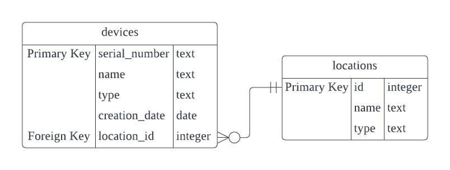

# Database Structure

The database file, named "registry.db," was implemented using sqlite3. It contains two tables: one for the metadata of all devices (`devices`) and another for the factory floor locations (`locations`).

## ER Diagram

This notation illustrates that while a device must be linked to a location (mandatory relationship), a location might have no devices associated with it or multiple devices associated (optional relationship).

## Constraints

- All columns cannot be null.
- All attributes with type TEXT are case insensitive.
- The `devices` table has the `serial_number` column as the primary key, and the `location_id` column is the foreign key relating to the `id` column in the `locations` table.
- The `locations` table has the `id` column as the primary key.

### Table 1: Devices

#### Columns

- `serial_number` (TEXT, no case, Primary Key): Unique identifier for each device. The value is not assigned automatically (without RowID setting was used) and has to be provided explicitly.
- `name` (TEXT, no case, not null): Device name.
- `type` (TEXT, no case, not null): Device type.
- `creation_date` (DATE, not null): Date when the device was created. The expected format is YYYY-MM-DD.
- `location_id` (INTEGER, Foreign Key, not null): Relates to the `id` in the `Locations` Table.

#### Example Row

'1', 'Device A', 'Type A', 2023-12-12, 1

### Table 2: Locations

#### Columns

- `id` (INTEGER, Primary Key): Unique identifier for each location. The ID values are managed automatically (RowID was used). When inserting a new entry and not specifying an ID value explicitly, the database assigns the new row an ID that is one greater than the largest existing ID in the database. If this integer reaches the maximum allowed value, the database assigns a smaller unused integer. However, if an ID is provided explicitly, it must be unique within the database. Failure to provide a unique ID will cause errors during the addition of new data.
- `name` (TEXT, no case, not null): Location name.
- `type` (TEXT, no case, not null): Location type.

#### Example Row

1, 'Location A', 'Location Type A'
